# Visual Framework
{: .no_toc }

Interactive decision trees to guide Microsoft AI technology selection.
{: .fs-6 .fw-300 }

## Table of contents
{: .no_toc .text-delta }

1. TOC
{:toc}

---

## About This Visual Framework

These diagrams provide **visual representations** of the [Decision Framework](decision-framework.md) methodology, helping you navigate Microsoft's AI portfolio through interactive flowcharts.

### Optimal Learning Path

Follow this sequence through the documentation for the best learning experience:

```mermaid
%%{init: {'theme':'dark', 'themeVariables': {'fontSize':'16px'}}}%%
flowchart LR
    Start([Start Here]) --> CM[📚 Capability Model<br/>Five-Layer Architecture]
    CM --> DF[🎯 Decision Framework<br/>BXT Methodology]
    DF --> SC[💼 Scenarios<br/>Real-World Examples]
    SC --> VF[📊 Visual Framework<br/>Interactive Diagrams]
    VF --> EC[✅ Evaluation Criteria<br/>Assess Requirements]
    EC --> IP[🏗️ Implementation Patterns<br/>Build Guidance]
    IP --> TECH[🔧 Technologies<br/>Technical Deep Dive]
    TECH --> FC[📋 Feature Comparison<br/>Side-by-Side Matrices]
    
    %% Reference materials (not in main flow)
    FC -.-> QR[⚡ Quick Reference]
    FC -.-> RES[🔗 Resources]
    FC -.-> GLOSS[📖 Glossary]
    
    style Start fill:#4CAF50,stroke:#2E7D32,color:#fff
    style VF fill:#2196F3,stroke:#1565C0,color:#fff
    style QR fill:#9E9E9E,stroke:#616161,color:#fff
    style RES fill:#9E9E9E,stroke:#616161,color:#fff
    style GLOSS fill:#9E9E9E,stroke:#616161,color:#fff
    
    classDef mainPath fill:#1976D2,stroke:#0D47A1,color:#fff
    class CM,DF,SC,EC,IP,TECH,FC mainPath
```

**📌 Main Learning Path** (blue): Foundation → Context → Application → Assessment → Execution → Reference  
**📎 Reference Materials** (gray, dotted): Quick Reference, Resources, Glossary - use as needed, not part of sequential flow

### How This Connects to the Complete Framework

| **You Are Here** | **This Provides** | **Complements** |
|------------------|-------------------|-----------------|
| **Visual Framework** | Decision tree diagrams | [Decision Framework](decision-framework.md) - Written methodology (BXT + 6 Questions) |
| | Technology selection paths | [Scenarios](scenarios.md) - Real-world examples with step-by-step guidance |
| | Complexity/budget/governance views | [Evaluation Criteria](evaluation-criteria.md) - Assessment frameworks and checklists |
| | Multi-agent orchestration patterns | [Quick Reference](quick-reference.md) - Fast-lookup tables for common needs |
| | Upgrade path visualization | [Capability Model](capability-model.md) - Five architectural layers |

### Navigation Guide

**🎯 If you're a visual learner:** Start here with the diagrams  
**📖 If you prefer written guidance:** Start with [Decision Framework](decision-framework.md)  
**🔍 If you need fast answers:** Jump to [Quick Reference](quick-reference.md)  
**💼 If you have a specific use case:** See [Scenarios](scenarios.md)  
**🏗️ If you need architecture context:** Review [Capability Model](capability-model.md)

---

## Diagram Index

| Diagram | Purpose | Maps To Framework |
|---------|---------|-------------------|
| **1. Complete Decision Flow** | End-to-end technology selection | [Phase 2: Q1-Q6](decision-framework.md#phase-2-technology-groupings-six-critical-questions) - All six critical questions |
| **2. Data Grounding Decision** | Data strategy and knowledge sources | [Phase 2: Q4](decision-framework.md#question-4-data-strategy--knowledge) - Data grounding patterns |
| **3. Persona-Based Flow** | Selection by role and skill level | [Phase 2: Q2](decision-framework.md#question-2-build-style--control-level) - Build approach + [Scenarios](scenarios.md) |
| **4. Complexity Assessment** | Technical complexity evaluation | [Evaluation Criteria: Complexity](evaluation-criteria.md#1-technical-complexity-assessment) |
| **5. Budget & Timeline** | Cost and time-to-production paths | [Evaluation Criteria: Budget & Time](evaluation-criteria.md#3-budget-assessment) |
| **6. Governance & Compliance** | Security and compliance requirements | [Evaluation Criteria: Governance](evaluation-criteria.md#5-governance--compliance) |
| **7. Multi-Agent Orchestration** | Multi-agent patterns and frameworks | [Quick Reference: Orchestration Complexity](quick-reference.md#orchestration-complexity-decision-matrix) |
| **8. Upgrade Paths** | Migration and enhancement options | [Capability Model: Layers 1-3](capability-model.md) - Technology progression |

---

## Complete Decision Flow

### Validation Summary

**Last Validated:** November 2025

**Validated Technologies:**

*UI-Based Agents (GA unless noted):*
- **M365 Copilot:** Conversational chat in M365 apps [(docs)](https://learn.microsoft.com/en-us/microsoft-365-copilot/extensibility/)
- **Copilot Studio:** Low-code, 13+ channels [(docs)](https://learn.microsoft.com/en-us/microsoft-copilot-studio/fundamentals-what-is-copilot-studio)
- **M365 Agents SDK:** Pro-code, 10+ channels, C#/JS/Python [(docs)](https://learn.microsoft.com/en-us/microsoft-365/agents-sdk/agents-sdk-overview)
- **Azure AI Foundry:** Custom UI deployment [(docs)](https://learn.microsoft.com/en-us/azure/ai-foundry/openai/how-to/use-web-app)

*Autonomous Agents:*
- **Logic Apps AI Agent Workflows (Preview):** Event-driven, 1,400+ connectors [(docs)](https://learn.microsoft.com/en-us/azure/logic-apps/agent-workflows-concepts)
- **Azure AI Foundry Agent Service:** Custom orchestration [(docs)](https://learn.microsoft.com/en-us/azure/ai-foundry/agents/overview)

*API/Headless Services (GA):*
- **Azure AI Agent Service:** REST API, managed PaaS [(docs)](https://learn.microsoft.com/en-us/azure/ai-foundry/agents/quickstart)
- **Azure AI Foundry:** REST API deployment [(docs)](https://learn.microsoft.com/en-us/rest/api/aifoundry/)

*Vector Databases:*
- **Cosmos DB (GA):** IVF, HNSW, DiskANN algorithms [(docs)](https://learn.microsoft.com/en-us/azure/cosmos-db/nosql/vector-search)
- **PostgreSQL pgvector (GA):** Extension 0.7.0 [(docs)](https://learn.microsoft.com/en-us/azure/postgresql/flexible-server/how-to-use-pgvector)
- **SQL Server 2025 VECTOR (Preview):** Native type, float32/float16 [(docs)](https://learn.microsoft.com/en-us/sql/t-sql/data-types/vector-data-type)

---

## Persona-Based Flow

### Validation Summary - Persona-Based Flow

**Last Validated:** November 3, 2025

**Persona-to-Technology Mappings:**

*End User (GA):*
- **M365 Copilot:** Built-in AI in M365 apps, no setup required - [M365 Copilot](https://learn.microsoft.com/en-us/microsoft-365-copilot/extensibility/)

*Business Maker (GA):*
- **Copilot Studio:** Low-code platform, no dev support needed - [Copilot Studio](https://learn.microsoft.com/en-us/microsoft-copilot-studio/fundamentals-what-is-copilot-studio)
- **Copilot Studio + Custom Actions:** Low-code with occasional developer support for custom connectors/flows - [Custom Actions](https://learn.microsoft.com/en-us/microsoft-copilot-studio/copilot-plugins-overview)

*Developer (GA unless noted):*
- **M365 Agents SDK:** Pro-code for M365-centric solutions, C#/JavaScript/Python, 10+ channels - [M365 Agents SDK](https://learn.microsoft.com/en-us/microsoft-365-copilot/extensibility/overview-custom-engine-agent)
- **Azure AI Foundry:** Pro-code for Azure-centric solutions, custom models, full control - [Azure AI Foundry](https://learn.microsoft.com/en-us/azure/ai-foundry/what-is-azure-ai-foundry)
- **Copilot Studio + Custom Actions:** Mid-level developers, low-code with custom code extensibility - [Copilot Studio Extensibility](https://learn.microsoft.com/en-us/microsoft-copilot-studio/copilot-plugins-overview)
- **Logic Apps AI Agent Workflows (Preview):** Event-driven autonomous agents, 1,400+ connectors - [Logic Apps Agent Workflows](https://learn.microsoft.com/en-us/azure/logic-apps/agent-workflows-concepts)

*Data Scientist/Analyst:*
- **Fabric Data Agents (Preview):** Analytics/BI focus, Python SDK, evaluation capabilities, Power BI/semantic models - [Fabric Data Agents](https://learn.microsoft.com/en-us/fabric/data-science/concept-data-agent) | [Python SDK](https://learn.microsoft.com/en-us/fabric/data-science/evaluate-data-agent)
- **Azure AI Foundry (GA):** ML/custom models, full AI/ML pipeline control - [Azure AI Foundry](https://learn.microsoft.com/en-us/azure/ai-foundry/what-is-azure-ai-foundry)

*Integration Specialist:*
- **Logic Apps AI Agent Workflows (Preview):** Enterprise integration focus, 1,400+ connectors, workflow automation - [Logic Apps Overview](https://learn.microsoft.com/en-us/azure/logic-apps/logic-apps-overview) | [AI Agent Workflows](https://learn.microsoft.com/en-us/azure/logic-apps/agent-workflows-concepts)

---

## Data Grounding Decision

### Validation Summary - Data Grounding Decision

**Last Validated:** November 3, 2025

**Validated Technologies:**

*M365 Data Sources (GA):*
- **Microsoft Graph Connectors:** M365 data sources (SharePoint, OneDrive, Teams) - [Graph Connectors Overview](https://learn.microsoft.com/en-us/microsoftsearch/connectors-overview)

*Document Processing - File Search (GA):*
- **Azure AI Agent Service File Search Tool:** Built-in file search with automatic parsing, chunking (800 tokens/400 overlap), embedding (text-embedding-3-large), keyword + semantic search, reranking. Supports up to 10,000 files per vector store (max 512 MB/file). Two modes: Basic (Microsoft-managed) vs Standard (BYO Azure AI Search + Blob Storage). Supported formats: .doc, .docx, .pdf, .pptx, .py, .md, .txt, .json, .html, .java, .cs, .cpp, and more. Service handles entire ingestion automatically. - [Agent Service File Search](https://learn.microsoft.com/en-us/azure/ai-foundry/agents/how-to/tools/file-search)
- **Copilot Studio Knowledge Base:** File upload from local/OneDrive/SharePoint. Supports .doc, .docx, .ppt, .pptx, .pdf, .xls, .xlsx, .txt, .md, .html, .csv, .xml. Max 512 MB per file, up to 500 files per agent. Automatic chunking and vectorization into Dataverse with semantic indexing. OneDrive/SharePoint: Auto-sync (updates reflected automatically) vs Upload: Static files. SharePoint: User-scoped permissions (only files user has access to). - [Copilot Studio Knowledge](https://learn.microsoft.com/en-us/microsoft-copilot-studio/knowledge-unstructured-data) | [File Upload](https://learn.microsoft.com/en-us/microsoft-copilot-studio/knowledge-add-file-upload) | [SharePoint Files](https://learn.microsoft.com/en-us/microsoft-copilot-studio/knowledge-add-unstructured-data)

*Document Processing - Production Scale (GA):*
- **Azure AI Search:** Document indexing, full-text search, vector search, hybrid queries, custom chunking strategies (fixed-size, variable-size, Document Layout skill). Requires manual setup of indexers, skillsets, chunking strategy. Production-scale scenarios with millions of documents. - [AI Search Overview](https://learn.microsoft.com/en-us/azure/search/search-what-is-azure-search) | [Chunking Strategies](https://learn.microsoft.com/en-us/azure/search/vector-search-how-to-chunk-documents)

*Document Processing - Multimodal (Preview):*
- **Azure AI Content Understanding:** Multimodal processing (documents/images/audio/video), RAG-ready Markdown output, AI Search custom skill integration, built-in chunking, standard/pro modes. API version: 2025-05-01-preview. - [Content Understanding Overview](https://learn.microsoft.com/en-us/azure/ai-services/content-understanding/overview) | [Multimodal Search](https://learn.microsoft.com/en-us/azure/search/multimodal-search-overview)

*Structured Databases - Vector Search (GA):*
- **Cosmos DB Vector Search:** IVF/HNSW/DiskANN algorithms, NoSQL & MongoDB vCore APIs - [Cosmos DB Vector Search](https://learn.microsoft.com/en-us/azure/cosmos-db/vector-database)
- **PostgreSQL pgvector:** Extension version 0.7.0, HNSW/IVF indexes - [PostgreSQL Vector Search](https://learn.microsoft.com/en-us/azure/postgresql/flexible-server/how-to-use-pgvector)
- **SQL Server 2025 VECTOR (Preview RC1):** Native VECTOR data type, float32 (1,998 dims)/float16 (3,996 dims) - [SQL Server Vector](https://learn.microsoft.com/en-us/sql/t-sql/data-types/vector-data-type)

*Analytics Platform (GA with Preview features):*
- **Microsoft Fabric Platform (GA):** Direct knowledge source access via Lakehouse (Delta tables, Spark), Warehouse (T-SQL), OneLake (ADLS Gen2 APIs), KQL databases. Azure AI Foundry integration for RAG - [Fabric Overview](https://learn.microsoft.com/en-us/fabric/fundamentals/microsoft-fabric-overview) | [AI Foundry Fabric Integration](https://learn.microsoft.com/en-us/azure/ai-foundry/faq)
- **Fabric Data Agents (Preview):** Analytics data grounding (warehouses, lakehouses, Power BI semantic models, KQL databases), Copilot Studio connected agents, Azure AI Agent Service integration - [Fabric Data Agents](https://learn.microsoft.com/en-us/fabric/data-science/concept-data-agent) | [Copilot Studio Integration](https://learn.microsoft.com/en-us/fabric/data-science/data-agent-microsoft-copilot-studio)

*MCP Integration (Preview):*
- **Logic Apps MCP Server:** Standard logic apps as remote MCP servers, 1,400+ connectors, OAuth 2.0 auth, Streamable HTTP/SSE transports - [Logic Apps MCP Server](https://learn.microsoft.com/en-us/azure/logic-apps/set-up-model-context-protocol-server-standard) | [API Center Integration](https://learn.microsoft.com/en-us/azure/logic-apps/create-mcp-server-api-center)

**When to Use File Search vs Azure AI Search:**
- **File Search (Agent Service/Copilot Studio):** Up to 10,000 files, simple setup (no manual indexer/chunking config), automatic embedding, suitable for smaller document sets, internal knowledge bases, rapid prototyping. Cost: Included in Agent Service consumption or Copilot Studio credits.
- **Azure AI Search:** Production scale (millions of documents), custom chunking strategies required, advanced features (analyzers, scoring profiles, faceting), complex indexing pipelines, enterprise search. Cost: Dedicated AI Search tier (Basic ~$75/mo to S3 ~$3K/mo).

---

## Complexity Assessment Flow

---

## Budget & Timeline Tradeoffs

### Validation Summary - Budget & Timeline Tradeoffs

**Last Validated:** November 3, 2025

**Budget Band Rationale:**

*M365-Only ($0 AI infrastructure add'l):*
- **M365 Copilot Chat:** Included with M365 subscription, web-grounded chat and instruction-based agents [(docs)](https://learn.microsoft.com/en-us/microsoft-365-copilot/extensibility/cost-considerations#licensing-options-for-microsoft-365-copilot)
- **M365 Copilot + Graph Connectors:** $30/user/month M365 Copilot license, Graph Connectors included at no extra charge [(docs)](https://learn.microsoft.com/en-us/microsoft-copilot-studio/billing-licensing#copilot-studio-use-rights-included-with-microsoft-365-copilot-license)
- **Declarative Agents:** Instruction-based or public-web grounded = $0; shared tenant data = PAYG [(docs)](https://learn.microsoft.com/en-us/microsoft-365-copilot/extensibility/cost-considerations#agents-in-copilot)

*Starter ($200-500/mo):*
- **Copilot Studio PAYG:** $0.01 per Copilot Credit, typical usage $200-500/mo for starter scenarios [(docs)](https://learn.microsoft.com/en-us/microsoft-copilot-studio/billing-licensing#copilot-studio-pay-as-you-go)
- **AI Builder:** Included in Power Platform, document processing (invoices, receipts, contracts) [(docs)](https://learn.microsoft.com/en-us/ai-builder/overview)
- **Logic Apps AI Workflows (Preview):** Consumption ~$200-400/mo for typical workflows, event-driven agents [(docs)](https://learn.microsoft.com/en-us/azure/logic-apps/agent-workflows-concepts)

*Growth ($1K-5K/mo):*
- **Copilot Studio Capacity Packs:** $200/month per 25,000 credits prepaid [(docs)](https://learn.microsoft.com/en-us/microsoft-copilot-studio/billing-licensing#copilot-studio-prepaid-copilot-credits-subscription)
- **M365 SDK + Azure:** SDK free; Azure hosting (App Service ~$100-300/mo) + Azure OpenAI PAYG (~$500-2K/mo tokens) [(docs)](https://learn.microsoft.com/en-us/microsoft-365-copilot/extensibility/cost-considerations#agents-in-copilot)
- **Azure AI Foundry Starter:** PAYG tokens + AI Search Basic (~$75/mo) = $1-5K/mo estimate [(docs)](https://azure.microsoft.com/pricing/details/cognitive-services/openai-service/) | [(AI Search pricing)](https://learn.microsoft.com/en-us/azure/search/search-sku-tier#tier-descriptions)

*Enterprise ($5K+/mo):*
- **Foundry Serverless:** PAYG tokens at scale + AI Search Standard S1 (~$250/mo) = $5-15K/mo [(docs)](https://learn.microsoft.com/en-us/azure/search/search-sku-tier#tier-descriptions)
- **Foundry + Agent Service:** Managed orchestration PaaS + AI Search S2 (~$1K/mo) = $10-30K/mo [(docs)](https://learn.microsoft.com/en-us/azure/ai-foundry/agents/overview)
- **Foundry PTU + Premium:** PTU reservations (50+ PTUs minimum) + AI Search S2/S3 = $30K+/mo [(docs)](https://learn.microsoft.com/en-us/azure/ai-foundry/openai/how-to/provisioned-throughput-onboarding#hourly-usage)

**Timeline Estimates:**
- Days: M365 built-in features, no development [(scenarios)](https://learn.microsoft.com/en-us/microsoft-365-copilot/extensibility/overview)
- 1-2 Weeks: Low-code platforms (Copilot Studio, Logic Apps) [(HR Knowledge Base scenario)](../scenarios.md)
- 1-3 Months: Custom agents with SDKs, moderate complexity [(Customer Support scenario)](../scenarios.md)
- 3-6 Months: Azure AI Foundry custom solutions, complex orchestration [(evaluation-criteria)](../evaluation-criteria.md#4-time-to-production)
- 6+ Months: Enterprise-scale with PTU, fine-tuning, advanced patterns

**Cost Calculation Notes:**
- M365 per-user costs ($30/user/month) NOT included in bands - these are AI infrastructure costs only
- Estimates assume moderate usage (not high-scale production)
- Azure consumption highly variable based on tokens, requests, storage
- PTU (Provisioned Throughput Units) require Azure Reservations for cost optimization

**Sources:**
- [Copilot Studio Licensing](https://learn.microsoft.com/en-us/microsoft-copilot-studio/billing-licensing) (Updated: 2025)
- [M365 Copilot Cost Considerations](https://learn.microsoft.com/en-us/microsoft-365-copilot/extensibility/cost-considerations) (Updated: 2025)
- [Azure OpenAI Pricing](https://azure.microsoft.com/pricing/details/cognitive-services/openai-service/) (Updated: 2025)
- [Azure AI Search Tiers](https://learn.microsoft.com/en-us/azure/search/search-sku-tier) (Updated: 2025)
- [Logic Apps AI Agent Workflows](https://learn.microsoft.com/en-us/azure/logic-apps/agent-workflows-concepts) (Preview, Updated: 2025)
- [AI Builder Overview](https://learn.microsoft.com/en-us/ai-builder/overview) (Updated: 2025)

---

## Governance & Compliance Path

```mermaid
flowchart TD
    Start([Governance Requirements]) --> Q1{Data residency<br/>requirement?}
    
    Q1 -->|M365 tenant only<br/>Strict boundary| R1[M365 Tenant Boundary]
    Q1 -->|Azure region<br/>Configurable| R2[Azure Region Control]
    Q1 -->|Flexible<br/>Multi-region OK| R3[Flexible Residency]
    
    R1 --> Q2{Built-in DLP<br/>sufficient?}
    Q2 -->|Yes, inherit M365| G1[M365 Copilot GA<br/>• M365 trust boundary + Entra ID<br/>• Auto DLP, sensitivity labels<br/>• Purview audit all interactions<br/>• GDPR, HIPAA, ISO 27001, FedRAMP<br/>• Complexity: LOW, Cost: $30/user/mo]
    Q2 -->|Need custom agents| G2[Copilot Studio GA<br/>• Power Platform RBAC + DLP<br/>• Environment-level governance<br/>• Connector controls 1P/3P<br/>• Purview audit + analytics<br/>• GDPR, HIPAA, ISO 27001, FedRAMP<br/>• Complexity: MEDIUM, Cost: $200/mo or PAYG]
    
    R2 --> Q3{Network<br/>isolation?}
    Q3 -->|VNet + private<br/>endpoints required| G3[Azure AI Foundry GA<br/>• Azure RBAC control/data plane<br/>• VNet, private endpoints, NSGs<br/>• Managed identity resource+project<br/>• Customer-managed keys optional<br/>• Azure Monitor + Log Analytics<br/>• Complexity: HIGH, Cost: Consumption]
    Q3 -->|Managed runtime<br/>+ VNet needed| G4[AI Agent Service GA<br/>• Full RBAC project + resource<br/>• VNet, private endpoints, BYO storage<br/>• Azure Monitor project-scoped<br/>• Azure Policy integration<br/>• Complexity: HIGH, Cost: Consumption]
    Q3 -->|Power Platform<br/>governance sufficient| G5[AI Builder GA<br/>• Power Platform DLP<br/>• Dataverse RBAC roles<br/>• PP environment location<br/>• Complexity: LOW-MEDIUM<br/>• Cost: Copilot Studio Credits]
    
    R3 --> Q4{Development<br/>model?}
    Q4 -->|Enterprise workflows<br/>+ integration| G6[Logic Apps Standard GA<br/>• Granular Azure RBAC + managed ID<br/>• VNet, private endpoints Standard<br/>• Customer Lockbox support<br/>• Azure Policy + audit logs<br/>• FedRAMP, HIPAA, ISO 27001<br/>• Complexity: HIGH, Cost: ~$200/mo]
    Q4 -->|Multi-channel<br/>custom agents| G7[M365 Agents SDK GA<br/>• Custom auth MSAL, Entra ID<br/>• Hosting platform RBAC Azure/on-prem<br/>• Custom telemetry implementation<br/>• Compliance inherits from host<br/>• Complexity: HIGH, Cost: Hosting only]
    Q4 -->|Orchestration<br/>library only| G8[Agent Framework Preview<br/>• No built-in governance<br/>• Inherits from host application<br/>• App-level RBAC + audit<br/>• Compliance via hosting platform<br/>• Complexity: MEDIUM-HIGH, Cost: FREE]
    
    style G1 fill:#107C10,color:#fff
    style G2 fill:#0078D4,color:#fff
    style G3 fill:#0078D4,color:#fff
    style G4 fill:#0078D4,color:#fff
    style G5 fill:#FFB900,color:#000
    style G6 fill:#0078D4,color:#fff
    style G7 fill:#5C2D91,color:#fff
    style G8 fill:#E81123,color:#fff
```

### Validation Summary: Governance & Compliance Path

**Last Validated:** November 2025

**M365 Copilot (GA)** - STRICT GOVERNANCE:
- **Data Residency:** M365 tenant boundary only. No data leaves M365 trust boundary. [Source: Data, Privacy, and Security for M365 Copilot](https://learn.microsoft.com/en-us/copilot/microsoft-365/microsoft-365-copilot-privacy)
- **Built-in Governance:** Inherits all M365 Entra ID permissions, DLP policies, sensitivity labels, Conditional Access. No custom configuration required. [Source: Security for M365 Copilot](https://learn.microsoft.com/en-us/copilot/microsoft-365/microsoft-365-copilot-ai-security)
- **Audit:** Microsoft Purview audit logs capture all interactions (prompts + responses). [Source: M365 Copilot Audit Logs](https://learn.microsoft.com/en-us/purview/audit-copilot)
- **Compliance:** GDPR, HIPAA, ISO 27001, ISO 42001 (AI management systems), FedRAMP. [Source: M365 Copilot Privacy](https://learn.microsoft.com/en-us/copilot/microsoft-365/microsoft-365-copilot-privacy#meeting-regulatory-compliance-requirements)
- **Complexity:** LOW (fully managed, no configuration). **Cost:** $30/user/month.

**Copilot Studio (GA)** - MEDIUM-HIGH GOVERNANCE:
- **Data Residency:** Configurable by Power Platform environment geography (Azure regions). [Source: Geographic Data Residency in Copilot Studio](https://learn.microsoft.com/en-us/microsoft-copilot-studio/geo-data-residency-security)
- **RBAC:** Power Platform RBAC with Entra ID. Environment-level roles (admin, maker, end-user). [Source: Copilot Studio Security](https://learn.microsoft.com/en-us/microsoft-copilot-studio/security-and-governance)
- **DLP:** Power Platform DLP policies control 1P/3P connector usage (business vs non-business). [Source: DLP in Copilot Studio](https://learn.microsoft.com/en-us/microsoft-copilot-studio/admin-data-loss-prevention)
- **ALM:** Dev/test/prod environment management with deployment pipelines. [Source: Copilot Studio Experience](https://learn.microsoft.com/en-us/microsoft-365-copilot/extensibility/copilot-studio-experience#full-experience-governance-principles)
- **Audit:** Microsoft Purview audit logs + Copilot Studio analytics. [Source: Copilot Studio Logging](https://learn.microsoft.com/en-us/microsoft-copilot-studio/admin-logging-copilot-studio)
- **Compliance:** ISO 27001, SOC 1/2/3, GDPR, FedRAMP, HIPAA. [Source: Copilot Studio Compliance](https://learn.microsoft.com/en-us/microsoft-copilot-studio/admin-certification)
- **Complexity:** MEDIUM (admin center configuration). **Cost:** $200/month prepaid (25K credits) or $0.01/credit PAYG.

**Azure AI Foundry (GA)** - HIGH GOVERNANCE:
- **Data Residency:** Azure region selection. Data stored in selected geography. [Source: Azure AI Foundry Planning](https://learn.microsoft.com/en-us/azure/ai-foundry/concepts/planning#securing-the-ai-foundry-environment)
- **RBAC:** Azure RBAC with control plane (resource management) and data plane (model access) separation. Resource-level + project-level assignments. [Source: Azure AI Foundry Architecture](https://learn.microsoft.com/en-us/azure/ai-foundry/concepts/architecture#security-driven-separation-of-concerns)
- **Managed Identity:** Supported at both resource and project level for passwordless auth. [Source: Azure AI Foundry Security](https://learn.microsoft.com/en-us/azure/ai-foundry/concepts/planning#securing-the-ai-foundry-environment)
- **Networking:** VNet integration, private endpoints, NSGs for traffic isolation. [Source: Configure Private Link](https://learn.microsoft.com/en-us/azure/ai-foundry/how-to/configure-private-link)
- **Encryption:** Customer-managed keys (CMK) optional for strict compliance. [Source: CMK in Azure AI Foundry](https://learn.microsoft.com/en-us/azure/ai-foundry/concepts/encryption-keys-portal)
- **Audit:** Azure Monitor + Log Analytics for detailed logging. [Source: Monitor Applications](https://learn.microsoft.com/en-us/azure/ai-foundry/how-to/monitor-applications)
- **Governance:** Azure Policy for model deployment control, cost management, quotas. [Source: Built-in Policy Model Deployment](https://learn.microsoft.com/en-us/azure/ai-foundry/how-to/built-in-policy-model-deployment)
- **Compliance:** ISO 27001, SOC 2, GDPR. [Source: Azure Compliance](https://learn.microsoft.com/en-us/azure/compliance/)
- **Complexity:** HIGH (requires Azure infrastructure + networking knowledge). **Cost:** Consumption-based (varies by model usage).

**Azure AI Agent Service (GA May 2025)** - HIGH GOVERNANCE:
- **Data Residency:** Same as Azure AI Foundry (Azure region selection). [Source: Agents Data Privacy](https://learn.microsoft.com/en-us/azure/ai-foundry/responsible-ai/agents/data-privacy-security)
- **RBAC:** Full Azure RBAC at project + resource level. Granular access control. [Source: AI Agent Service Security Training](https://learn.microsoft.com/en-us/training/modules/intro-ai-agent-service-security-controls/3-azure-ai-agent-service-role-based-access-control)
- **Networking:** VNet, private endpoints, BYO storage for threads/messages. [Source: Virtual Networks for Agents](https://learn.microsoft.com/en-us/azure/ai-foundry/agents/how-to/virtual-networks)
- **Managed Identity:** Supported at resource + project scopes. [Source: Azure AI Foundry Security](https://learn.microsoft.com/en-us/azure/ai-foundry/concepts/planning)
- **Audit:** Azure Monitor metrics (project-scoped), Log Analytics. [Source: Azure AI Foundry Architecture](https://learn.microsoft.com/en-us/azure/ai-foundry/concepts/architecture#security-driven-separation-of-concerns)
- **Governance:** Azure Policy integration, TPM limits at deployment level. [Source: Azure AI Foundry Governance](https://learn.microsoft.com/en-us/azure/ai-foundry/concepts/planning#governance)
- **Complexity:** HIGH (PaaS but requires Azure networking + RBAC config). **Cost:** Consumption-based (included in Azure AI Foundry).

**AI Builder (GA)** - MEDIUM GOVERNANCE:
- **Data Residency:** Power Platform environment location (geography). [Source: Power Platform Compliance](https://learn.microsoft.com/en-us/power-platform/guidance/adoption/compliance)
- **RBAC:** Dataverse security roles (Environment Maker, System Customizer). [Source: AI Builder Roles](https://learn.microsoft.com/en-us/ai-builder/security)
- **DLP:** Power Platform DLP policies (part of Dataverse connector). [Source: AI Builder DLP](https://learn.microsoft.com/en-us/ai-builder/administer#data-loss-prevention-dlp)
- **Audit:** Power Platform audit logs. [Source: Power Platform Logging](https://learn.microsoft.com/en-us/power-platform/admin/logging-power-automate)
- **Networking:** No custom networking (tenant-level controls only).
- **Complexity:** LOW-MEDIUM (low-code, simpler than Azure). **Cost:** Copilot Studio Credits (consumption).

**Azure Logic Apps Standard (GA)** - HIGH GOVERNANCE:
- **Data Residency:** Azure region selection. [Source: Logic Apps Overview](https://learn.microsoft.com/en-us/azure/logic-apps/)
- **RBAC:** Granular Azure RBAC with Entra ID. [Source: Logic Apps Security Baseline](https://learn.microsoft.com/en-us/security/benchmark/azure/baselines/logic-apps-security-baseline#identity-management)
- **Managed Identity:** Full support for authentication to Azure services. [Source: Logic Apps Managed Identity](https://learn.microsoft.com/en-us/security/benchmark/azure/baselines/logic-apps-security-baseline#identity-management)
- **Networking:** VNet integration, private endpoints (Standard only). [Source: Power Automate Migration Comparison](https://learn.microsoft.com/en-us/azure/logic-apps/power-automate-migration#compare-capability-details)
- **Encryption:** Data at rest + in transit. Customer-managed keys for ISE. [Source: Logic Apps Security](https://learn.microsoft.com/en-us/azure/logic-apps/security-controls-policy)
- **Audit:** Azure security audit logs + diagnostic logs. [Source: Logic Apps Policy](https://learn.microsoft.com/en-us/azure/logic-apps/security-controls-policy)
- **Customer Lockbox:** Supported for Microsoft support access control. [Source: Logic Apps Baseline](https://learn.microsoft.com/en-us/security/benchmark/azure/baselines/logic-apps-security-baseline#privileged-access)
- **Compliance:** FedRAMP High/Moderate, HIPAA, ISO 27001, SOC 1/2/3. [Source: Logic Apps Regulatory Compliance](https://learn.microsoft.com/en-us/azure/logic-apps/security-controls-policy)
- **Complexity:** HIGH (pro-code, enterprise integration). **Cost:** Consumption ~$0.000125/action OR Standard ~$200/month.

**M365 Agents SDK (GA)** - CUSTOM GOVERNANCE:
- **Authentication:** Bring your own (MSAL, Entra ID, OAuth 2.0, client cert, managed identity). [Source: M365 SDK Auth Configuration](https://learn.microsoft.com/en-us/microsoft-365/agents-sdk/microsoft-authentication-library-configuration-options)
- **RBAC:** Custom implementation via hosting platform (Azure RBAC, Entra ID, custom).
- **Data Residency:** Depends on hosting environment (Azure regions, on-prem, multi-cloud).
- **Audit:** Custom telemetry implementation (Application Insights, custom logging).
- **DLP:** Implement via hosting layer (no built-in SDK DLP).
- **Compliance:** Inherits from hosting environment (Azure, on-prem compliance frameworks).
- **Complexity:** HIGH (pro-code, full control = full responsibility for governance). **Cost:** FREE SDK (costs from hosting: Azure App Service, Functions, AKS).

**Microsoft Agent Framework (Preview)** - NO BUILT-IN GOVERNANCE:
- **Governance:** No built-in governance (orchestration library only). [Source: Agent Framework Overview](https://learn.microsoft.com/en-us/agent-framework/)
- **Authentication:** Inherits from hosting application (M365 Agents SDK or custom app).
- **RBAC:** Application-level implementation (not framework-level).
- **Audit:** Application-level logging (framework doesn't provide audit).
- **Compliance:** Depends entirely on hosting platform.
- **Complexity:** MEDIUM-HIGH (requires integration with hosting platform). **Cost:** FREE (open-source library).

**Key Findings:**
1. **M365 Copilot** = Strictest built-in governance, lowest complexity (fully managed).
2. **Copilot Studio** = Balanced managed governance with admin controls (environment-level).
3. **Azure AI Foundry + Agent Service** = Enterprise-grade governance but highest complexity (networking + RBAC expertise required).
4. **AI Builder** = Power Platform governance (simpler than Azure, more than M365 Copilot).
5. **Logic Apps** = Enterprise governance with workflow focus (Standard = VNet, Consumption = limited networking).
6. **M365 Agents SDK** = Custom governance (flexible but requires full implementation).
7. **Agent Framework** = No governance (library only, inherits from host).

**Decision Criteria:**
- **Data residency = M365 only** → M365 Copilot or Copilot Studio
- **Data residency = Azure region** → Azure AI Foundry, Agent Service, Logic Apps
- **Built-in DLP required** → M365 Copilot (automatic) or Copilot Studio (Power Platform DLP)
- **VNet isolation required** → Azure AI Foundry, Agent Service, Logic Apps Standard
- **Low complexity needed** → M365 Copilot, AI Builder
- **Enterprise integration workflows** → Logic Apps Standard (1,400+ connectors + governance)
- **Multi-channel custom agents** → M365 Agents SDK (custom governance implementation)

**Documentation Sources:**
- [M365 Copilot Privacy](https://learn.microsoft.com/en-us/copilot/microsoft-365/microsoft-365-copilot-privacy)
- [M365 Copilot Security](https://learn.microsoft.com/en-us/copilot/microsoft-365/microsoft-365-copilot-ai-security)
- [Copilot Studio Security](https://learn.microsoft.com/en-us/microsoft-copilot-studio/security-and-governance)
- [Azure AI Foundry Security](https://learn.microsoft.com/en-us/azure/ai-foundry/concepts/planning)
- [AI Agent Service Security](https://learn.microsoft.com/en-us/azure/ai-foundry/responsible-ai/agents/data-privacy-security)
- [AI Builder Governance](https://learn.microsoft.com/en-us/ai-builder/administer)
- [Logic Apps Security](https://learn.microsoft.com/en-us/azure/logic-apps/security-controls-policy)
- [M365 Agents SDK Auth](https://learn.microsoft.com/en-us/microsoft-365/agents-sdk/microsoft-authentication-library-configuration-options)

---

## Multi-Agent Orchestration

### Validation Summary: Multi-Agent Orchestration

**Connected Agents / Sub-Agent Pattern:**

- **Copilot Studio (Preview):** Connected agents feature supports other Copilot Studio agents + Fabric Data Agents in same environment. Child agents are lightweight sub-agents within main agent. Handoffs enable agent-to-agent transfer.
- **Azure AI Foundry Agent Service (GA May 2025):** Connected agents feature allows main agent to delegate to purpose-built sub-agents using natural language routing. No custom orchestrator required.
- **Fabric Data Agents (Preview):** Can participate as connected agent in Copilot Studio or integrate with Azure AI Agent Service. Consumed BY other agents for data grounding—NOT itself an orchestrator.

**Agent Workflow Orchestration:**

- **Microsoft Agent Framework (Preview/Experimental):** Provides Sequential, Concurrent, Handoff, and Magentic orchestration patterns. Available in C#, Python via Semantic Kernel. Under active development.
- **Semantic Kernel:** Supports Sequential, Concurrent, Group Chat, Handoff, and Magentic orchestration patterns.
- **M365 Agents SDK:** Integrates with Microsoft Agent Framework or Semantic Kernel for orchestration. "Bring your own orchestrator" model—does NOT have built-in Agent Framework.
- **LangGraph:** Third-party framework (not Microsoft) providing state graph management for complex workflows.

**Event-Driven Agents:**

- **Logic Apps AI Agent Workflows (Preview):** Event triggers + MCP Server for enterprise system integration. Triggers SINGLE agent via events—NOT multi-agent orchestration.
- **Azure Functions + Agent Service:** Event-driven invocation of single agents. Event routing, not multi-agent coordination.
- **Event Grid + Foundry:** Event routing to agents. Routes events to trigger agents independently—NOT multi-agent orchestration.

**Sources:**

- [Build AI agents with Copilot Studio](https://learn.microsoft.com/microsoft-copilot-studio/copilot-ai-plugins) — Updated 2025-01-29
- [Connect agents in Copilot Studio (Preview)](https://learn.microsoft.com/microsoft-copilot-studio/advanced-connected-agents) — Updated 2025-01-20
- [Microsoft Agent Framework overview](https://learn.microsoft.com/semantic-kernel/frameworks/agent/agent-framework) — Updated 2024-12-18
- [Connected agents in Azure AI Foundry](https://learn.microsoft.com/azure/ai-services/agents/concepts/connected-agents) — Updated 2025-04-30
- [Add Fabric Data agent as connected agent (Preview)](https://learn.microsoft.com/fabric/data-activator/data-agent-copilot-studio-integration) — Updated 2025-01-30
- [Semantic Kernel agents](https://learn.microsoft.com/semantic-kernel/frameworks/agent/) — Updated 2024-12-18
- [Logic Apps AI Agent Workflows (Preview)](https://learn.microsoft.com/azure/logic-apps/create-run-ai-agent-workflow) — Updated 2025-01-15

---

## Upgrade Paths

### Validation Summary: Upgrade Paths

**M365 Copilot Extensions:**

- **Graph Connectors (GA Mar 2025):** Add enterprise data from external sources (Stack Overflow, Salesforce, GitHub, custom APIs). Works across M365 Copilot, Copilot Studio, and Microsoft Search. Can use without migrating to Copilot Studio.

**Copilot Studio Enhancements:**

- **Azure AI Foundry Model Connector:** Connect Azure AI Foundry deployed models (GPT-4o, Phi-3.5-vision, fine-tuned models) to Copilot Studio prompts via connector. Enables using custom or fine-tuned models without full migration.
- **Custom Actions:** Extend agents with custom APIs and workflows. Bridge between low-code and pro-code development.

**M365 Agents SDK Integration:**

- **Azure AI Foundry:** Add Azure AI models, custom model deployments, and advanced AI services to M365 SDK agents. Provides AI infrastructure beyond M365 boundaries.
- **Orchestration Frameworks:** M365 SDK supports bring-your-own-orchestrator model. Options include:
  - **Semantic Kernel:** Microsoft framework with Agent Framework patterns (Preview/Experimental - Sequential, Concurrent, Handoff, Magentic)
  - **LangChain:** Third-party orchestration framework
  - **LangGraph:** Third-party state graph management (not Microsoft product)
  - **Custom orchestration:** Build your own orchestrator

**Azure AI Foundry Advanced Features:**

- **Fine-Tuned Models:** Deploy and use fine-tuned custom models via serverless API deployments.
- **Custom Model Deployments:** Deploy models from catalog (1900+ models from Microsoft, OpenAI, Meta, Hugging Face, partners).

**Key Migration Insights:**

- Graph Connectors can be added to M365 Copilot WITHOUT migrating to Copilot Studio (enhancement, not migration requirement)
- M365 SDK is model- and orchestrator-agnostic - supports ANY AI stack via bring-your-own approach
- Microsoft Agent Framework is orchestration pattern IN Semantic Kernel, not standalone Azure AI Foundry feature
- LangGraph and LangChain are third-party frameworks (not Microsoft products) - supported via M365 SDK's flexible architecture

**Sources:**

- [Graph connectors for M365 Copilot](https://learn.microsoft.com/en-us/power-platform/release-plan/2024wave2/microsoft-copilot-studio/add-enterprise-data-new-graph-connections) — Updated 2024-11-06
- [Bring your own model for prompts](https://learn.microsoft.com/en-us/ai-builder/byom-for-your-prompts) — Updated 2025-01-31
- [M365 Agents SDK overview](https://learn.microsoft.com/en-us/microsoft-365-copilot/extensibility/create-deploy-agents-sdk) — Updated 2025-01-27
- [Semantic Kernel and Agent Framework in Agents SDK](https://learn.microsoft.com/en-us/microsoft-365/agents-sdk/using-semantic-kernel-agent-framework) — Updated 2025-01-15
- [Azure AI Foundry Models overview](https://learn.microsoft.com/en-us/azure/ai-foundry/concepts/foundry-models-overview) — Updated 2025-04-23

---

## Legend

### Decision Nodes

- 🔷 **Diamond:** Decision point requiring evaluation
- 🟦 **Rectangle:** Technology recommendation
- 🔵 **Circle:** Start/End point

### Colors

- **Blue (#0078D4):** Microsoft primary technologies
- **Purple (#5C2D91):** Developer-focused solutions
- **Green (#107C10):** Low complexity / fast path
- **Orange (#FFB900):** Medium complexity
- **Red (#D83B01):** High complexity / enterprise

---

## How to Use These Diagrams

1. **Start with Complete Decision Flow** for full end-to-end guidance
2. **Use Persona-Based Flow** if you know your role
3. **Jump to Data Grounding** if data architecture is your concern
4. **Check Complexity Assessment** to estimate effort
5. **Review Budget & Timeline** to set realistic expectations
6. **Verify Governance Path** for compliance requirements
7. **Explore Multi-Agent** if orchestration is needed
8. **Plan Upgrade Paths** for evolution strategy

---

## Next Steps

**Detailed comparisons:**  
→ [Feature Comparison](feature-comparison.md)

**Real-world examples:**  
→ [Scenarios](scenarios.md)

**Evaluate readiness:**  
→ [Evaluation Criteria](evaluation-criteria.md)

---

**Last Updated:** November 2025  
**Next:** [Evaluation Criteria](evaluation-criteria.md) - Assess complexity, skills, budget, and governance requirements

